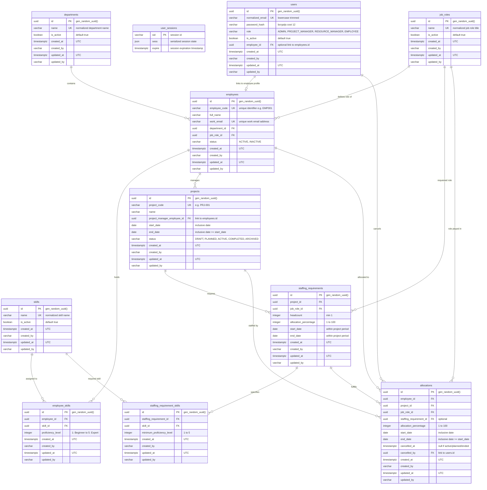

# Staffora Entity Relationship Diagram (ERD)

This document represents the authoritative data model and relational baseline for **Staffora MVP v1.0** as specified in the Technical Specification Document (TSD Section 9 & 12).

---

## 1. Mermaid Entity-Relationship Diagram

---

## 2. Table Specifications & Constraints

### 2.1 `users`
- **Purpose**: Application accounts for authentication and authorization.
- **Constraints**:
  - `normalized_email`: Unique index, converted to lowercase and trimmed before insertion.
  - `role`: One of `ADMIN`, `PROJECT_MANAGER`, `RESOURCE_MANAGER`, `EMPLOYEE`.
  - `employee_id`: Foreign key to `employees.id` (nullable for Admin without employee profile; required for PM/RM/Employee per business rule BR-G02).

### 2.2 `user_sessions`
- **Purpose**: Server-side session store managed by `connect-pg-simple`.
- **Fields**:
  - `sid` (varchar PK)
  - `sess` (json not null)
  - `expire` (timestamptz not null with B-tree index)

### 2.3 `departments` & `job_roles`
- **Purpose**: Master tables providing standardized taxonomy for resources, staffing requirements, and allocations.
- **Constraints**:
  - `name`: Unique constraint (case-insensitive/normalized).

### 2.4 `employees`
- **Purpose**: Resource profiles representing the internal workforce.
- **Constraints**:
  - `employee_code`: Unique identifier.
  - `work_email`: Unique work email address.
  - `status`: One of `ACTIVE`, `INACTIVE`.
  - Index on `(status, department_id, job_role_id)` for high performance filtering.

### 2.5 `skills` & `employee_skills`
- **Purpose**: Competency catalog and employee proficiency tracking.
- **Constraints**:
  - `proficiency_level`: Integer constraint between `1` (Beginner) and `5` (Expert).
  - Unique composite index `(employee_id, skill_id)` ensures a skill cannot be assigned twice to the same employee.
  - Index on `(skill_id, proficiency_level, employee_id)` for Resource Finder query acceleration.

### 2.6 `projects`
- **Purpose**: Project boundaries and project management ownership.
- **Constraints**:
  - `project_code`: Unique identifier.
  - Date rule: `end_date >= start_date`.
  - `status`: One of `DRAFT`, `PLANNED`, `ACTIVE`, `COMPLETED`, `ARCHIVED`.
  - Index on `(status, project_manager_employee_id, start_date, end_date)`.

### 2.7 `staffing_requirements` & `staffing_requirement_skills`
- **Purpose**: Staffing demand planning per project.
- **Constraints**:
  - `headcount >= 1`.
  - `allocation_percentage` between 1 and 100.
  - Dates must fall within parent project `[start_date, end_date]`.
  - Unique constraint on `(staffing_requirement_id, skill_id)`.

### 2.8 `allocations`
- **Purpose**: Actual workforce assignment to projects.
- **Constraints**:
  - `allocation_percentage` between 1 and 100.
  - Dates must fall within parent project `[start_date, end_date]`.
  - Capacity Integrity: Maximum concurrent allocation per employee cannot exceed 100% on any date.
  - Compound indexes on `(employee_id, start_date, end_date)` and `(project_id, start_date, end_date)`.

---

## 3. Allocation Lifecycle & Calculation State

In accordance with TSD Section 9.3, display status is calculated deterministically on demand without background cron:
- **`CANCELLED`**: `cancelled_at IS NOT NULL`
- **`PLANNED`**: `cancelled_at IS NULL AND start_date > CURRENT_DATE`
- **`ACTIVE`**: `cancelled_at IS NULL AND start_date <= CURRENT_DATE AND end_date >= CURRENT_DATE`
- **`ENDED`**: `cancelled_at IS NULL AND end_date < CURRENT_DATE`
